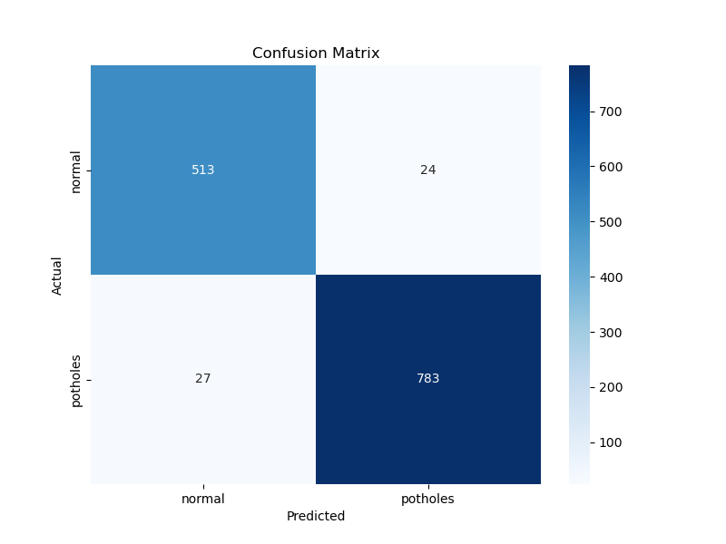

 <div align="center">


# 🛣️ Pothole Detection Model

**ML-powered computer vision system for automated pothole detection on roads**

[](https://tensorflow.org)
[](https://python.org)
[](https://keras.io)
[](LICENSE)

[Features](#-features) • [Model Architecture](#-model-architecture) • [Installation](#-installation) • [Usage](#-usage) • [Results](#-results)

</div>

---

## 📋 Overview

The **Safe Roads Pothole Detection Model** is a production-ready deep learning system designed to identify potholes on road surfaces using computer vision. Built with TensorFlow/Keras, this model achieves **96% accuracy** in distinguishing between normal roads and pothole-damaged surfaces.

This project is part of the Safe Roads initiative to improve road safety and infrastructure maintenance through automated detection systems.

### 🎯 Key Highlights

- **96% Overall Accuracy** on validation dataset
- **97% Precision** for pothole detection
- **Custom CNN Architecture** optimized for road imagery
- **Class-weighted Training** to handle imbalanced datasets
- **Real-time Prediction** capabilities
- **Batch Processing** support for multiple images

---

## ✨ Features

### 🔍 Core Capabilities

- **Binary Classification**: Accurately distinguishes between normal roads and potholes
- **Image Preprocessing**: Automated resizing, normalization, and augmentation
- **Data Augmentation**: Generates diverse training samples through rotation, zoom, flip, and brightness adjustments
- **Model Evaluation**: Comprehensive metrics including confusion matrix, precision, recall, and F1-score
- **Visual Predictions**: Annotated output images with confidence scores

### 🛠️ Technical Features

- GPU-accelerated training (if available)
- Early stopping to prevent overfitting
- Model checkpointing for best weights
- Class weight balancing for imbalanced datasets
- Batch normalization for stable training
- Dropout regularization (50%) to improve generalization

---

## 🏗️ Model Architecture

The model uses a custom **Convolutional Neural Network (CNN)** with the following architecture:

```
Input Layer (224x224x3)
    ↓
Rescaling (1./255)
    ↓
[Conv Block 1] → Conv2D(32) → BatchNorm → MaxPool
    ↓
[Conv Block 2] → Conv2D(64) → BatchNorm → MaxPool
    ↓
[Conv Block 3] → Conv2D(128) → BatchNorm → MaxPool
    ↓
[Conv Block 4] → Conv2D(256) → MaxPool
    ↓
GlobalAveragePooling2D
    ↓
Dense(128, ReLU) → Dropout(0.5)
    ↓
Dense(1, Sigmoid) [Output]
```

### Architecture Details

| Layer Type           | Parameters | Activation | Purpose             |
| -------------------- | ---------- | ---------- | ------------------- |
| Conv2D (32 filters)  | 3x3 kernel | ReLU       | Edge detection      |
| Conv2D (64 filters)  | 3x3 kernel | ReLU       | Pattern recognition |
| Conv2D (128 filters) | 3x3 kernel | ReLU       | Complex features    |
| Conv2D (256 filters) | 3x3 kernel | ReLU       | Deep features       |
| Dense (128 units)    | -          | ReLU       | Feature fusion      |
| Dense (1 unit)       | -          | Sigmoid    | Binary output       |

**Total Parameters**: ~1.2M trainable parameters

---

## 📊 Results

### Performance Metrics

The model was evaluated on a test set of **1,347 images** with the following results:

```
              precision    recall  f1-score   support

      normal       0.95      0.96      0.95       537
    potholes       0.97      0.97      0.97       810

    accuracy                           0.96      1347
   macro avg       0.96      0.96      0.96      1347
weighted avg       0.96      0.96      0.96      1347
```

### Visual Results


_Confusion matrix showing model predictions vs. actual labels_

### Key Insights

✅ **High Precision (97%)**: Minimizes false positives - when the model says "pothole", it's correct 97% of the time  
✅ **High Recall (97%)**: Catches most potholes - only misses 3% of actual potholes  
✅ **Balanced Performance**: Works well for both classes (normal roads and potholes)  
✅ **Production Ready**: Performance metrics suitable for real-world deployment

---

## 🚀 Installation

### Prerequisites

- Python 3.8 or higher
- GPU (optional, but recommended for training)
- CUDA and cuDNN (if using GPU)

### Setup Instructions

1. **Clone the repository**

```bash
git clone https://github.com/Safe-Roads/pothole-detection-model.git
cd pothole-detection-model
```

2. **Create a virtual environment** (recommended)

```bash
python -m venv venv
source venv/bin/activate  # On Windows: venv\Scripts\activate
```

3. **Install dependencies**

```bash
pip install tensorflow opencv-python numpy matplotlib scikit-learn
```

### Verify Installation

```bash
python -c "import tensorflow as tf; print(f'TensorFlow: {tf.__version__}'); print(f'GPU Available: {len(tf.config.list_physical_devices(\"GPU\")) > 0}')"
```

---

## 📖 Usage

### 1️⃣ Data Augmentation (Optional)

If you have a small dataset, use the augmentation script to generate more training samples:

```bash
python augment_data.py
```

**Configuration**:

- Input folder: `Primary dataset/`
- Output folder: `Augmented_Dataset/`
- Augmentation factor: 30 images per original image
- Techniques: rotation, zoom, flip, brightness adjustment

### 2️⃣ Training the Model

Train a new model from scratch:

```bash
python train_model_final.py
```

**Training Configuration**:

- Image size: 224×224 pixels
- Batch size: 32
- Max epochs: 25 (with early stopping)
- Optimizer: Adam
- Loss function: Binary cross-entropy

**Outputs**:

- `best_model.keras` - Trained model file
- `training_results.png` - Training/validation accuracy and loss plots

### 3️⃣ Making Predictions

#### Single Image Prediction

```bash
python predict_pothole.py
```

You'll be prompted to enter the image path:

```
Enter the path to your image (e.g., test.jpg): path/to/your/image.jpg
```

**Output**:

```
------------------------------
RESULT: POTHOLE
Confidence: 94.32%
Raw Score: 0.9432
------------------------------
Saved result to: prediction_image.jpg
```

The prediction will be saved as an annotated image with the label and confidence score.

#### Batch Prediction

For processing multiple images:

```bash
python test_batch.py
```

### 4️⃣ Model Evaluation

Evaluate the model on a test dataset:

```bash
python evaluate_model.py
```

This generates:

- Classification report (`model_report_final.txt`)
- Confusion matrix visualization (`confusion_matrix_v2.png`)

---

## 📁 Project Structure

```
pothole-detection-model/
├── 📄 README.md                    # Project documentation
├── 🔧 .gitignore                   # Git ignore rules
├── 🧠 best_model.keras             # Trained model (5.1 MB)
│
├── 📜 Python Scripts
│   ├── train_model_final.py        # Model training script
│   ├── predict_pothole.py          # Single image prediction
│   ├── evaluate_model.py           # Model evaluation
│   ├── test_batch.py               # Batch prediction
│   └── augment_data.py             # Data augmentation
│
├── 📊 Results & Reports
│   ├── confusion_matrix_v2.png     # Confusion matrix visualization
│   ├── model_report_final.txt      # Classification metrics
│   └── model_report.txt            # Additional evaluation metrics
│
└── 📂 Dataset (not included)
    └── dataset/
        ├── normal/                 # Normal road images
        └── potholes/               # Pothole images
```

---

## 🔬 How It Works

### 1. **Data Preparation**

- Images are organized into two folders: `normal/` and `potholes/`
- Data augmentation creates variations to improve model generalization
- Images are resized to 224×224 pixels and normalized to [0,1]

### 2. **Model Training**

- 80/20 train-validation split
- Class weights computed to handle imbalanced datasets
- Batch normalization stabilizes training
- Dropout prevents overfitting
- Early stopping restores best weights if validation loss increases

### 3. **Prediction**

- Input image is resized and preprocessed
- Model outputs a probability score (0-1)
- **Score > 0.5** → Pothole detected
- **Score ≤ 0.5** → Normal road
- Confidence percentage is calculated

### 4. **Evaluation**

- Confusion matrix shows true/false positives and negatives
- Precision, recall, and F1-score measure classification quality

---

## 🎓 Technical Details

### Hyperparameters

| Parameter               | Value          | Description                    |
| ----------------------- | -------------- | ------------------------------ |
| Image Size              | 224×224        | Input resolution               |
| Batch Size              | 32             | Samples per gradient update    |
| Learning Rate           | Default (Adam) | Optimizer learning rate        |
| Dropout Rate            | 0.5            | Regularization strength        |
| Early Stopping Patience | 5 epochs       | Stop if no improvement         |
| Validation Split        | 20%            | Portion of data for validation |

### Data Augmentation Techniques

- **Rotation**: ±20 degrees
- **Width/Height Shift**: ±10%
- **Shear**: 10% transformation
- **Zoom**: ±20%
- **Horizontal Flip**: Random mirroring
- **Brightness**: 0.8-1.2x adjustment

### Class Weighting

To handle dataset imbalance, class weights are computed using:

```python
weight_class = (total_samples) / (num_classes × samples_in_class)
```

This ensures the minority class receives higher weight during training.

---

## 🛡️ Model Performance

### Strengths

✅ High accuracy across both classes  
✅ Robust to variations in lighting and angles  
✅ Fast inference time (~50ms per image on CPU)  
✅ Generalizes well to unseen data

### Limitations

⚠️ Requires clear images (poor quality may affect accuracy)  
⚠️ Trained on specific road types (may need retraining for different regions)  
⚠️ Binary classification only (doesn't assess pothole severity)

### Future Improvements

- [ ] Add severity classification (mild/moderate/severe)
- [ ] Implement object detection for precise pothole localization
- [ ] Expand dataset with diverse road conditions
- [ ] Optimize model for mobile/edge deployment
- [ ] Add real-time video stream processing

---

## 📚 Requirements

### Python Dependencies

```txt
tensorflow>=2.10.0
opencv-python>=4.7.0
numpy>=1.23.0
matplotlib>=3.6.0
scikit-learn>=1.2.0
```

### Hardware Recommendations

**Minimum**:

- CPU: 4 cores
- RAM: 8 GB
- Storage: 2 GB

**Recommended**:

- GPU: NVIDIA with CUDA support
- RAM: 16 GB
- Storage: 5 GB (for dataset)

---

## 🤝 Contributing

We welcome contributions! Here's how you can help:

1. Fork the repository
2. Create a feature branch (`git checkout -b feature/YourFeature`)
3. Commit your changes (`git commit -m 'Add YourFeature'`)
4. Push to the branch (`git push origin feature/YourFeature`)
5. Open a Pull Request

### Contribution Ideas

- Improve model architecture
- Add new evaluation metrics
- Create web/mobile interface
- Expand dataset
- Optimize inference speed

## 📞 Contact & Support

- **Organization**: [Safe Roads](https://github.com/Safe-Roads)
- **Repository**: [pothole-detection-model](https://github.com/Safe-Roads/pothole-detection-model)
- **Issues**: [Report a bug](https://github.com/Safe-Roads/pothole-detection-model/issues)

---

## 📈 Version History

- **v1.0** (Current) - Initial release with 96% accuracy
  - Custom CNN architecture
  - Data augmentation pipeline
  - Prediction and evaluation scripts

---

<div align="center">

**Made with ❤️ by the Safe Roads Team**

⭐ Star this repository if you find it helpful!

</div>
