<div align="center">


# 🛣️ Pothole Detection Model

**AI-Powered Computer Vision System for Automated Road Damage Detection**

[](https://tensorflow.org)
[](https://python.org)
[](https://keras.io)
[](https://opencv.org)
[](LICENSE)

[Features](#-features) • [Quick Start](#-quick-start) • [Model Architecture](#-model-architecture) • [Usage](#-usage) • [Results](#-results) • [Contributing](#-contributing)

---

</div>

## 📋 Overview

The **Safe Roads Pothole Detection Model** is a production-ready deep learning system designed to identify potholes on road surfaces using state-of-the-art computer vision techniques. Built with TensorFlow/Keras, this model achieves **96% overall accuracy** with **97% precision** for pothole detection.

This project is part of the **Safe Roads initiative** to improve road safety and infrastructure maintenance through automated detection systems, enabling:

- 🚗 **Smart City Integration** - Real-time road monitoring
- 📱 **Mobile Applications** - Crowdsourced road condition reporting
- 🏗️ **Infrastructure Planning** - Data-driven maintenance scheduling
- 💰 **Cost Reduction** - Automated damage assessment

### 🎯 Key Highlights

<div align="center">

| Metric | Value | Description |
|--------|-------|-------------|
| **Overall Accuracy** | 96% | Validated on 1,347 test images |
| **Precision** | 97% | High confidence when detecting potholes |
| **Recall** | 97% | Catches 97% of actual potholes |
| **F1-Score** | 0.97 | Excellent balance of precision & recall |
| **Model Size** | 5.1 MB | Lightweight for edge deployment |
| **Inference Speed** | ~50ms | Fast predictions on CPU |

</div>

---

## ✨ Features

### 🔍 Core Capabilities

- **✅ Binary Classification**: Accurately distinguishes between normal roads and potholes
- **🖼️ Image Preprocessing**: Automated resizing, normalization, and augmentation pipeline
- **🔄 Data Augmentation**: Generates diverse training samples through rotation, zoom, flip, and brightness adjustments
- **📊 Comprehensive Metrics**: Confusion matrix, precision, recall, F1-score, and visual analytics
- **🎨 Visual Predictions**: Annotated output images with confidence scores and color-coded labels

### 🛠️ Technical Features


- 🛑 **Early Stopping** to prevent overfitting (patience: 5 epochs)
- 💾 **Model Checkpointing** for best weights preservation
- ⚖️ **Class Weight Balancing** for imbalanced datasets
- 📈 **Batch Normalization** for stable training
- 🎲 **Dropout Regularization** (50%) to improve generalization
- 🔀 **Data Prefetching & Caching** for optimized training performance

---

## 🚀 Quick Start

### Prerequisites

- **Python** 3.8 or higher
- **GPU** (optional, but recommended for training)
- **CUDA & cuDNN** (if using GPU)

### Installation

```bash
# 1. Clone the repository
git clone https://github.com/Safe-Roads/pothole-detection-model.git
cd pothole-detection-model

# 2. Create a virtual environment (recommended)
python -m venv venv

# On Windows:
venv\Scripts\activate

# On macOS/Linux:
source venv/bin/activate

# 3. Install dependencies
pip install tensorflow opencv-python numpy matplotlib scikit-learn seaborn
```

### Verify Installation

```bash
python -c "import tensorflow as tf; print(f'TensorFlow: {tf.__version__}'); print(f'GPU Available: {len(tf.config.list_physical_devices(\"GPU\")) > 0}')"
```

Expected output:
```
TensorFlow: 2.x.x
GPU Available: True  # or False if no GPU
```

---

## 🏗️ Model Architecture

The model uses a custom **Convolutional Neural Network (CNN)** optimized for road imagery analysis:


<div align="center">

```
📥 Input Layer (224×224×3 RGB Image)
    ↓
🔧 Rescaling Layer (normalize to [0,1])
    ↓
┌─────────────────────────────────┐
│  🔷 Convolutional Block 1       │
│  • Conv2D: 32 filters (3×3)     │
│  • Batch Normalization          │
│  • ReLU Activation              │
│  • MaxPooling2D (2×2)           │
└─────────────────────────────────┘
    ↓
┌─────────────────────────────────┐
│  🔷 Convolutional Block 2       │
│  • Conv2D: 64 filters (3×3)     │
│  • Batch Normalization          │
│  • ReLU Activation              │
│  • MaxPooling2D (2×2)           │
└─────────────────────────────────┘
    ↓
┌─────────────────────────────────┐
│  🔷 Convolutional Block 3       │
│  • Conv2D: 128 filters (3×3)    │
│  • Batch Normalization          │
│  • ReLU Activation              │
│  • MaxPooling2D (2×2)           │
└─────────────────────────────────┘
    ↓
┌─────────────────────────────────┐
│  🔷 Convolutional Block 4       │
│  • Conv2D: 256 filters (3×3)    │
│  • ReLU Activation              │
│  • MaxPooling2D (2×2)           │
└─────────────────────────────────┘
    ↓
🌐 GlobalAveragePooling2D
    ↓
🧠 Dense Layer (128 units, ReLU)
    ↓
🎲 Dropout (50%)
    ↓
📤 Output Layer (1 unit, Sigmoid)
    ↓
🎯 Binary Prediction (0=Normal, 1=Pothole)
```

</div>

### Architecture Details

| Layer Type | Output Shape | Parameters | Activation | Purpose |
|------------|-------------|------------|------------|---------|
| Input | (224, 224, 3) | 0 | - | RGB image input |
| Rescaling | (224, 224, 3) | 0 | - | Normalize pixels |
| Conv2D-1 | (224, 224, 32) | 896 | ReLU | Edge detection |
| BatchNorm-1 | (224, 224, 32) | 128 | - | Stabilize training |
| MaxPool-1 | (112, 112, 32) | 0 | - | Downsample |
| Conv2D-2 | (112, 112, 64) | 18,496 | ReLU | Pattern recognition |
| BatchNorm-2 | (112, 112, 64) | 256 | - | Stabilize training |
| MaxPool-2 | (56, 56, 64) | 0 | - | Downsample |
| Conv2D-3 | (56, 56, 128) | 73,856 | ReLU | Complex features |
| BatchNorm-3 | (56, 56, 128) | 512 | - | Stabilize training |
| MaxPool-3 | (28, 28, 128) | 0 | - | Downsample |
| Conv2D-4 | (28, 28, 256) | 295,168 | ReLU | Deep features |
| MaxPool-4 | (14, 14, 256) | 0 | - | Downsample |
| GlobalAvgPool | (256,) | 0 | - | Spatial aggregation |
| Dense-1 | (128,) | 32,896 | ReLU | Feature fusion |
| Dropout | (128,) | 0 | - | Regularization |
| Dense-2 | (1,) | 129 | Sigmoid | Binary output |

**Total Parameters**: ~1.2M trainable parameters

---

## 📊 Results

### Performance Metrics

The model was evaluated on a **validation set of 1,347 images** with the following results:

<div align="center">

```
              precision    recall  f1-score   support

      normal       0.95      0.96      0.95       537
    potholes       0.97      0.97      0.97       810

    accuracy                           0.96      1347
   macro avg       0.96      0.96      0.96      1347
weighted avg       0.96      0.96      0.96      1347
```

</div>

### Visual Analysis

<div align="center">


*Confusion matrix showing model predictions vs. actual labels on validation data*

</div>

### Key Insights

| Metric | Value | Interpretation |
|--------|-------|----------------|
| ✅ **True Positives** | 786 | Correctly identified potholes |
| ✅ **True Negatives** | 515 | Correctly identified normal roads |
| ⚠️ **False Positives** | 22 | Normal roads misclassified as potholes (4.1%) |
| ⚠️ **False Negatives** | 24 | Potholes misclassified as normal (2.9%) |

**🎯 Production Readiness:**
- **High Precision (97%)**: When the model says "pothole", it's correct 97% of the time
- **High Recall (97%)**: The model catches 97% of actual potholes (only misses 3%)
- **Balanced Performance**: Works equally well for both classes
- **Low False Negative Rate**: Critical for safety applications

---

## 📖 Usage

### 1️⃣ Data Augmentation (Optional)

If you have a small dataset, use the augmentation script to generate more training samples:

```bash
python augment_data.py
```

**Configuration Details:**

```python
INPUT_ROOT = "Primary dataset"      # Source folder with original images
OUTPUT_ROOT = "Augmented_Dataset"   # Output folder for augmented images
AUGMENT_FACTOR = 30                 # 30 variations per original image
```

**Required Folder Structure:**
```
Primary dataset/
├── potholes/       # Pothole images
└── roads/          # Normal road images
```

**Augmentation Techniques Applied:**
- 🔄 **Rotation**: ±20 degrees
- ↔️ **Width/Height Shift**: ±10%
- 🔀 **Shear Transformation**: 10%
- 🔍 **Zoom**: ±20%
- 🪞 **Horizontal Flip**: Random mirroring
- 💡 **Brightness**: 0.8-1.2x adjustment
- 🎨 **Fill Mode**: Nearest neighbor interpolation

**Expected Output:**
```
Processing class: potholes...
Finished potholes. Created ~3000 images.
Processing class: roads...
Finished roads. Created ~3000 images.

SUCCESS! Your new dataset is in 'Augmented_Dataset'.
```

---

### 2️⃣ Training the Model

Train a new model from scratch or fine-tune the existing one:

```bash
python train_model_final.py
```

**Training Configuration:**

| Parameter | Value | Description |
|-----------|-------|-------------|
| Data Directory | `dataset/` | Training data location |
| Image Size | 224×224 px | Input resolution |
| Batch Size | 32 | Samples per gradient update |
| Max Epochs | 25 | With early stopping |
| Validation Split | 20% | Portion held for validation |
| Optimizer | Adam | Adaptive learning rate |
| Loss Function | Binary Crossentropy | For binary classification |
| Early Stopping | Patience: 5 | Stop if no improvement |

**Expected Training Output:**
```
TensorFlow Version: 2.x.x
GPU Available: True

--- Loading Dataset ---
Found 5388 files belonging to 2 classes.
Using 4310 files for training.
Using 1078 files for validation.
Detected Classes: ['normal', 'potholes']

--- Calculating Class Weights ---
Count normal: 2687
Count potholes: 2701
Computed Weights: {0: 1.001, 1: 0.999}

Epoch 1/25
135/135 [==============================] - 45s 334ms/step - loss: 0.3456 - accuracy: 0.8432 - val_loss: 0.1234 - val_accuracy: 0.9543
...
Epoch 15/25
135/135 [==============================] - 38s 281ms/step - loss: 0.0789 - accuracy: 0.9678 - val_loss: 0.0912 - val_accuracy: 0.9621

Training complete!
Best model saved to: best_model.keras
```

**Generated Files:**
- `best_model.keras` - Trained model (5.1 MB)
- `training_results.png` - Training/validation accuracy and loss plots

---

### 3️⃣ Making Predictions

#### Single Image Prediction

```bash
python predict_pothole.py
```

**Interactive Usage:**
```
Enter the path to your image (e.g., test.jpg): road_image.jpg
```

**Sample Output:**
```
Loading Model...
Analyzing road_image.jpg...
------------------------------
RESULT: POTHOLE
Confidence: 94.32%
Raw Score: 0.9432
------------------------------
Saved result to: prediction_road_image.jpg
```

The script generates an annotated image with:
- **Red text** for potholes
- **Green text** for normal roads
- Confidence percentage overlay

#### Programmatic Usage

```python
from predict_pothole import predict_image

# Predict a single image
predict_image("path/to/image.jpg")
```

---

#### Batch Prediction

For processing multiple images at once:

```bash
python test_batch.py
```

**Setup:**
1. Create a `test_images/` folder (created automatically if missing)
2. Place your images in the folder
3. Run the script

**Sample Output:**
```
Loading Model...

Found 5 images. Analyzing...

FILENAME                       | PREDICTION      | CONFIDENCE
------------------------------------------------------------
road_1.jpg                     | ROAD            | 98.45%
pothole_1.jpg                  | POTHOLE         | 96.23%
road_2.jpg                     | ROAD            | 92.17%
pothole_2.jpg                  | POTHOLE         | 99.12%
unclear.jpg                    | ROAD            | 67.89%
```

---

### 4️⃣ Model Evaluation

Evaluate the model on the validation dataset and generate detailed metrics:

```bash
python evaluate_model.py
```

**What It Does:**
- Loads the trained model
- Runs predictions on the validation set (20% of data)
- Generates confusion matrix visualization
- Produces classification report with precision, recall, F1-score

**Generated Files:**
- `confusion_matrix_v2.png` - Visual confusion matrix
- `model_report_final.txt` - Text-based classification report

**Sample Output:**
```
Loading best_model.keras...

--- Loading Validation Data (Correctly Mixed) ---
Classes: ['normal', 'potholes']
Running Predictions on mixed data...

[Saved] confusion_matrix_v2.png

--- TRUE FINAL METRICS ---
              precision    recall  f1-score   support

      normal       0.95      0.96      0.95       537
    potholes       0.97      0.97      0.97       810

    accuracy                           0.96      1347
   macro avg       0.96      0.96      0.96      1347
weighted avg       0.96      0.96      0.96      1347
```

---


---

## 🔬 How It Works

### 🔄 End-to-End Pipeline

```mermaid
graph LR
    A[📸 Input Image] --> B[🔧 Resize to 224×224]
    B --> C[📊 Normalize to 0-1]
    C --> D[🧠 CNN Feature Extraction]
    D --> E[🎯 Binary Classification]
    E --> F{Score > 0.5?}
    F -->|Yes| G[🔴 POTHOLE]
    F -->|No| H[🟢 NORMAL ROAD]
    G --> I[📋 Confidence Score]
    H --> I
    I --> J[💾 Annotated Output]
```

<div align="center">



</div>

### 1. **Data Preparation**

**Dataset Organization:**
```
dataset/
├── normal/         # Class 0 (alphabetically first)
└── potholes/       # Class 1 (alphabetically second)
```

**Preprocessing Steps:**
1. Images loaded from class folders
2. Automatically labeled: 0 (normal), 1 (potholes)
3. Resized to 224×224 pixels
4. Pixel values normalized to [0, 1] range
5. 80/20 train-validation split with seed=42 for reproducibility

### 2. **Model Training**

**Class Balancing:**
```python
# Computed automatically to handle imbalanced data
weight_class = (total_samples) / (2 × samples_in_class)

# Example output:
# Class 0 (normal):   2687 images → weight: 1.001
# Class 1 (potholes): 2701 images → weight: 0.999
```

**Training Features:**
- ✅ **Data Caching**: Loads data once, reuses for epochs
- ✅ **Shuffling**: Randomizes batch order each epoch
- ✅ **Prefetching**: Loads next batch while GPU trains
- ✅ **Early Stopping**: Monitors validation loss with patience=5
- ✅ **Model Checkpointing**: Saves best model automatically

### 3. **Prediction Process**

**Step-by-Step:**
1. Load pre-trained model (`best_model.keras`)
2. Resize input image to 224×224
3. Normalize pixel values (divide by 255)
4. Pass through CNN to get probability score
5. Apply threshold (0.5):
   - Score > 0.5 → **POTHOLE** (Class 1)
   - Score ≤ 0.5 → **NORMAL** (Class 0)
6. Calculate confidence: `max(score, 1-score) × 100%`

**Example Scores:**
```
Raw Score: 0.9432 → POTHOLE (94.32% confidence)
Raw Score: 0.3217 → NORMAL (67.83% confidence)
Raw Score: 0.0134 → NORMAL (98.66% confidence)
```

### 4. **Evaluation Metrics**

**Confusion Matrix Interpretation:**
```
                  Predicted
                Normal | Pothole
Actual Normal     515  |   22     ← 96% recall for normal
Actual Pothole     24  |  786     ← 97% recall for potholes
                  ↑        ↑
                95.9%   97.2% precision
```

**Key Formulas:**
- **Precision** = TP / (TP + FP) → How many predictions are correct?
- **Recall** = TP / (TP + FN) → How many actual potholes are found?
- **F1-Score** = 2 × (Precision × Recall) / (Precision + Recall)

---

## 🎓 Technical Deep Dive

### Hyperparameters Summary

| Category | Parameter | Value | Rationale |
|----------|-----------|-------|-----------|
| **Input** | Image Size | 224×224 | Standard for CNN, balances detail & speed |
| | Channels | 3 (RGB) | Color information aids detection |
| **Training** | Batch Size | 32 | Optimal for 8-16GB GPU memory |
| | Max Epochs | 25 | Early stopping prevents unnecessary training |
| | Optimizer | Adam | Adaptive learning rate, robust |
| | Learning Rate | Default (0.001) | Standard for Adam optimizer |
| | Loss Function | Binary Crossentropy | Standard for binary classification |
| **Regularization** | Dropout Rate | 0.5 | Prevents overfitting in dense layer |
| | Batch Normalization | Yes | Stabilizes training, allows higher LR |
| | Early Stopping Patience | 5 epochs | Stops if val_loss doesn't improve |
| **Data** | Validation Split | 20% | Standard holdout for validation |
| | Random Seed | 42 | Ensures reproducibility |
| | Class Weights | Computed | Balances minority class |

### Data Augmentation Parameters

```python
ImageDataGenerator(
    rotation_range=20,           # ±20° rotation
    width_shift_range=0.1,       # ±10% horizontal shift
    height_shift_range=0.1,      # ±10% vertical shift
    shear_range=0.1,             # 10% shear transformation
    zoom_range=0.2,              # ±20% zoom
    horizontal_flip=True,        # 50% chance of mirroring
    brightness_range=[0.8, 1.2], # ±20% brightness
    fill_mode='nearest'          # Fill empty pixels
)
```

**Why Augmentation Helps:**
- 📈 Increases dataset size artificially
- 🔄 Simulates different camera angles
- 💡 Handles various lighting conditions
- 🎯 Improves model generalization

---

## 🛡️ Model Performance Analysis

### Strengths

| Aspect | Details |
|--------|---------|
| ✅ **High Accuracy** | 96% across both classes |
| ✅ **Robust Detection** | Works with varying lighting, angles, and road types |
| ✅ **Fast Inference** | ~50ms per image on CPU, <10ms on GPU |
| ✅ **Lightweight** | 5.1 MB model size (mobile-friendly) |
| ✅ **Low False Negatives** | Only misses 3% of potholes (critical for safety) |
| ✅ **Generalization** | Validated on unseen 20% of data |

### Limitations

| Limitation | Impact | Mitigation Strategy |
|------------|--------|---------------------|
| ⚠️ **Image Quality** | Blurry images reduce accuracy | Use minimum 720p resolution |
| ⚠️ **Extreme Angles** | Overhead shots may confuse model | Train with diverse perspectives |
| ⚠️ **Binary Only** | Can't assess severity (mild/severe) | Future: multi-class model |
| ⚠️ **Region-Specific** | Trained on specific road types | Expand dataset geographically |
| ⚠️ **Weather Conditions** | Snow/heavy rain may obscure potholes | Add weather-specific samples |

### Future Improvements

- [ ] 📍 **Object Detection**: Precise pothole localization (bounding boxes)
- [ ] 🌍 **Multi-Region Training**: Diverse road surfaces worldwide
- [ ] 📱 **Mobile Optimization**: TensorFlow Lite conversion
- [ ] 🎥 **Video Processing**: Real-time frame-by-frame analysis
- [ ] 🗺️ **GPS Integration**: Automated road damage mapping
- [ ] 🌐 **Web API**: RESTful service for cloud deployment
- [ ] 🤖 **Active Learning**: Continuous improvement from user feedback

---

## 📚 Requirements

### Python Dependencies

Create a `requirements.txt`:

```txt
tensorflow>=2.10.0
opencv-python>=4.7.0
numpy>=1.23.0
matplotlib>=3.6.0
scikit-learn>=1.2.0
seaborn>=0.12.0
```

Install all at once:
```bash
pip install -r requirements.txt
```

### Hardware Recommendations

#### Minimum (Inference Only)
- **CPU**: 4 cores @ 2.0 GHz
- **RAM**: 8 GB
- **Storage**: 2 GB free
- **OS**: Windows 10, macOS 10.15+, Ubuntu 18.04+

#### Recommended (Training & Inference)
- **GPU**: NVIDIA with CUDA support (GTX 1060 or better)
- **CPU**: 8 cores @ 3.0 GHz
- **RAM**: 16 GB
- **Storage**: 10 GB free (for datasets)
- **OS**: Windows 11, macOS 12+, Ubuntu 20.04+

---

## 🤝 Contributing

We welcome contributions from the community! Here's how you can help:

### Ways to Contribute

| Area | How to Help |
|------|-------------|
| 🐛 **Bug Fixes** | Report issues, fix bugs |
| 🚀 **Features** | Implement new capabilities |
| 📊 **Data** | Share labeled pothole datasets |
| 📝 **Documentation** | Improve guides, add tutorials |
| 🎨 **UI/UX** | Create web/mobile interfaces |
| 🧪 **Testing** | Add unit tests, validate models |
| 🌍 **Localization** | Translate documentation |

### Contribution Workflow

1. **Fork** the repository
2. **Create** a feature branch:
   ```bash
   git checkout -b feature/amazing-feature
   ```
3. **Make** your changes with clear commits:
   ```bash
   git commit -m "Add: severity classification feature"
   ```
4. **Push** to your fork:
   ```bash
   git push origin feature/amazing-feature
   ```
5. **Open** a Pull Request with:
   - Clear description of changes
   - Screenshots/examples (if applicable)
   - Link to related issues

### Development Setup

```bash
# Clone your fork
git clone https://github.com/YOUR-USERNAME/pothole-detection-model.git
cd pothole-detection-model

# Add upstream remote
git remote add upstream https://github.com/Safe-Roads/pothole-detection-model.git

# Create virtual environment
python -m venv venv
source venv/bin/activate  # or venv\Scripts\activate on Windows

# Install dependencies
pip install -r requirements.txt

# Run tests (if available)
python -m pytest tests/
```

### Code Style Guidelines

- Follow [PEP 8](https://pep8.org/) for Python code
- Use descriptive variable names
- Add docstrings to functions
- Comment complex logic
- Keep functions under 50 lines

---

## 📞 Contact & Support

<div align="center">

### Get in Touch

[](https://github.com/Safe-Roads)
[](https://github.com/Safe-Roads/pothole-detection-model/issues)
[](https://github.com/Safe-Roads/pothole-detection-model/discussions)

</div>


### Roadmap

**v1.1.0** (Planned)
- [ ] Add severity classification (3 levels)
- [ ] Web API with FastAPI
- [ ] Docker containerization
- [ ] CI/CD pipeline

**v2.0.0** (Future)
- [ ] Object detection (YOLO/Faster R-CNN)
- [ ] Mobile app (TensorFlow Lite)
- [ ] Real-time video processing
- [ ] Cloud deployment guide

---

## 📄 License

This project is licensed under the **MIT License** - see the [LICENSE](LICENSE) file for details.

```
MIT License

Copyright (c) 2024 Safe Roads

Permission is hereby granted, free of charge, to any person obtaining a copy
of this software and associated documentation files (the "Software"), to deal
in the Software without restriction, including without limitation the rights
to use, copy, modify, merge, publish, distribute, sublicense, and/or sell
copies of the Software, and to permit persons to whom the Software is
furnished to do so, subject to the following conditions:

The above copyright notice and this permission notice shall be included in all
copies or substantial portions of the Software.

THE SOFTWARE IS PROVIDED "AS IS", WITHOUT WARRANTY OF ANY KIND, EXPRESS OR
IMPLIED, INCLUDING BUT NOT LIMITED TO THE WARRANTIES OF MERCHANTABILITY,
FITNESS FOR A PARTICULAR PURPOSE AND NONINFRINGEMENT. IN NO EVENT SHALL THE
AUTHORS OR COPYRIGHT HOLDERS BE LIABLE FOR ANY CLAIM, DAMAGES OR OTHER
LIABILITY, WHETHER IN AN ACTION OF CONTRACT, TORT OR OTHERWISE, ARISING FROM,
OUT OF OR IN CONNECTION WITH THE SOFTWARE OR THE USE OR OTHER DEALINGS IN THE
SOFTWARE.
```

---


## 📊 Statistics

<div align="center">


</div>

---

<div align="center">

### 🌟 Star this repository if you find it helpful!

**Made with ❤️ by the Safe Roads Team**

*Building safer roads through AI innovation*

[⬆ Back to Top](#-pothole-detection-model)

</div>
